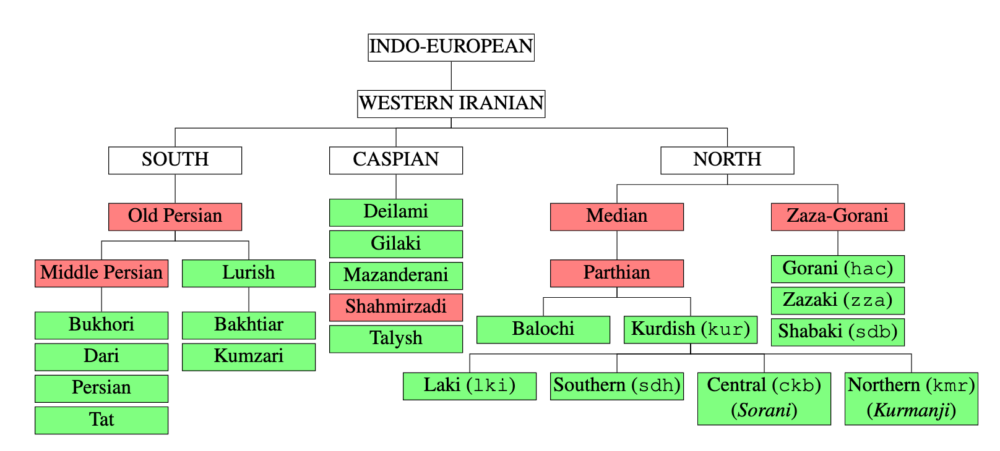

# A Corpus for the Zazaki and Gorani languages
##### For more information, see [this blog post](https://sinaahmadi.github.io/resources/zzahaccorpus.html).
---

This repository provides a corpus for two endangered languages of the [Zaza-Gorani language family](https://en.wikipedia.org/wiki/Zaza%E2%80%93Gorani_languages): [Zazaki](https://en.wikipedia.org/wiki/Zaza%E2%80%93Gorani_languages) and [Gorani](https://en.wikipedia.org/wiki/Gorani_language). These two languages along with [Shabaki](https://en.wikipedia.org/wiki/Shabaki_language) are the three languages belonging to the Zaza-Gorani language family and are popularly believed to belong to [Kurdish](https://en.wikipedia.org/wiki/Kurdish_languages). In [this paper](https://sinaahmadi.github.io/docs/articles/ahmadi2020zazagorani.pdf), we discuss how these languages are different from Kurdish, particularly the [Sorani](https://en.wikipedia.org/wiki/Sorani) and [Kurmanji](https://en.wikipedia.org/wiki/Kurmanji) dialects, in terms of phonetics, morphology and syntax.

We also report our efforts in collecting documents in various topics from news websites andcreate the first corpus for Zazaki and Gorani.  We believe that this corpus can pave the way for furtherdevelopments in linguistics and computer science, particularly in information retrieval and NLP wherelanguage modeling is beneficial to various applications such as grammatical and spell checkin

## Cite this corpus
If you're using this corpus, please don't forget to cite the following paper. 

	@inproceedings{ahmadi2020zazagorani,
	  title={{Building a Corpus for the Zaza–Gorani Language Family}},
	  author={Ahmadi, Sina},
	  booktitle={Proceedings of the Seventh Workshop on NLP for Similar Languages, Varieties and Dialects (VarDial 2020)},
	  pages={},
	  year={2020}
	}

This helps us to also find your work easily.

## License

 This work is licensed under a <a rel="license" href="http://creativecommons.org/licenses/by-sa/4.0/">Creative Commons Attribution-ShareAlike 4.0 International License</a>.